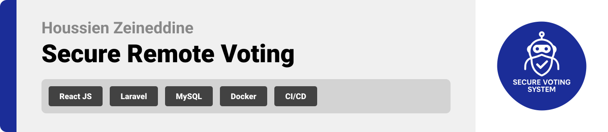

  

<!-- project overview -->

> This innovative project revolutionizes the electoral process by decisively tackling the critical challenges of our time—security, accessibility, and trust. Our platform empowers users to vote remotely while guaranteeing the highest standards of security, transparency, and efficiency.
>
> What sets this system apart is its cutting-edge integration of AI technology, expertly designed to detect and counter any suspicious voting behavior. Additionally, our geolocation features ensure that votes are cast from verified locations, reinforcing the integrity of the process. We are committed to delivering an outstanding user experience, guiding individuals confidently from start to finish in their voting journey. With this groundbreaking solution, we are not only redefining elections but also reigniting confidence and engagement among voters everywhere.

  

<!-- System Design -->

### ER Diagram

### Component Diagram

### System Architecture Diagram

### User Flow Diagram

  

<!-- Project Highlights -->

 

### A Secure, Smart, and Trustworthy Digital Voting Experience

- **Secure Remote Voting:** Cast your vote with confidence from anywhere in the world, thanks to our cutting-edge security measures designed to protect your voice against tampering.
- **AI-Powered Fraud Detection:** By harnessing the power of artificial intelligence, our system diligently monitors voting patterns to swiftly identify and flag any suspicious activities. This proactive approach guarantees the integrity of the electoral process, safeguarding the foundation of our democracy.
- **Geolocation-Based Validation:** Our innovative solution ensures that each vote is cast from an authorized location, enhancing the legitimacy of every ballot and fostering an unwavering trust in the democratic process.

  

<!-- Demo -->

<!-- ### User Screens (Mobile)

| Login screen                            | Register screen                       | Register screen                       |
| --------------------------------------- | ------------------------------------- | ------------------------------------- |
|  |  |  | -->

### Screens Demo

| Login screen                               | Register screen                             |
| ------------------------------------------ | ------------------------------------------- |
|  |  |

| Landing Page                                 | Dashboard                              |
| -------------------------------------------- | -------------------------------------- |
|  |  |

| Malicious Vote Detected (Malicious User Behavior) | Malicious Vote (Outside Region)                         |
| ------------------------------------------------- | ------------------------------------------------------- |
|     |  |

| Landing Page Demo                                  | Login Demo                              |
| -------------------------------------------------- | --------------------------------------- |
|  |  |

| Successfull Vote                                       | Malicious Vote Detection                                       |
| ------------------------------------------------------ | -------------------------------------------------------------- |
|  |  |

  

<!-- Development & Testing -->

### Some Code Snippets!

| Get Stats Service (Dashboard)                                | Edit Profile Backend Validation                                              | Register Login Testing                                         |
| ------------------------------------------------------------ | ---------------------------------------------------------------------------- | -------------------------------------------------------------- |
|  |  |  |

  

### Some Code Snippets!

| Working Pipeline                                |
| ----------------------------------------------- |
|  |

  

<!-- AI-Powered App -->

### AI-Powered Vote Validation

- **How it Works**

  To guarantee the integrity of the remote voting process, this system confidently utilizes AI to swiftly detect and filter out any suspicious or potentially malicious votes in real time.

- **Geolocation Validation**

  Each vote undergoes rigorous verification against the election region’s established geofence utilizing the Haversine formula. If a voter's latitude and longitude fall outside the designated radius, the vote is promptly flagged as malicious and recorded with the reason: “Location outside election region.”

- **AI Behavioral Analysis**

  For geolocation-valid votes, our AI model, utilizing the Prism PHP framework, conducts an in-depth analysis of voter behavior. It confidently constructs a context-aware prompt that considers:

  - The number of votes a user has cast in the last 10 minutes
  - The exact time of voting.

- **AI Behavioral Analysis**

  For geolocation-valid votes, our AI model, utilizing the Prism PHP framework, conducts an in-depth analysis of voter behavior. It confidently constructs a context-aware prompt that considers:

  - The number of votes a user has cast in the last 10 minutes
  - The exact time of voting.

 

**This prompt is then submitted to OpenAI's GPT-4o model, adhering to a strict schema that expects two keys: status (counted or malicious) and result (detailed explanation).**

 

- **Based on the AI's assessment**

  - When a vote is classified as counted, it is confidently stored in the CountedVotes table.
  - When a vote is identified as malicious, it is confidently recorded in the MaliciousVotes table, accompanied by the rationale provided by AI.

- **Failsafe: Smart Fallback Logic**

  In the event of an AI request failure—whether from rate limiting or unforeseen errors—the system will confidently revert to a robust fallback heuristic. This guarantees that the service remains stable, preventing any disruptions to the voting process.

  - **The fallback employs two definitive rules**

    - High-Frequency Detection: Any user casting more than 5 votes within a span of 10 minutes triggers a flag.

    - Odd-Hour Activity: Voting attempts occurring between 12:00 AM and 5:00 AM are scrutinized closely.

     

**Any deviation from these established patterns will categorize the vote as malicious, backed by clear reasoning; otherwise, the vote will be recognized as valid.**

**This robust validation mechanism not only bolsters trust and security but also guarantees high availability through effective error handling, ensuring the system remains reliable in all conditions.**

 

| Filter Vote                                            | Analyze Vote Behavior (PrismPHP) Demo                             |
| ------------------------------------------------------ | ----------------------------------------------------------------- |
|  |  |

| Successfull Vote                                       | Malicious Vote Detection                                       |
| ------------------------------------------------------ | -------------------------------------------------------------- |
|  |  |

  

<!-- Deployment -->

### API Showcase

- Explore the key API endpoints powering the system, including authentication, candidate management, and secure data access. Below are sample screenshots and descriptions of three primary API operations:

| Login API                                           | Get Candidates API                                     | Add Candidate API (Admin Only)                        |
| --------------------------------------------------- | ------------------------------------------------------ | ----------------------------------------------------- |
|  |  |  |

  

### API Showcase

- These APIs enable managing elections by allowing authorized users (admin) to add new elections, delete existing ones, and retrieve election details or lists. They support creating, removing, and fetching election data to facilitate the election lifecycle and user interaction.:

| Add Elections API (Admin Only)                          | Delete Elections API (Admin Only)                        | Get Elections API                                      |
| ------------------------------------------------------- | -------------------------------------------------------- | ------------------------------------------------------ |
|  |  |  |
